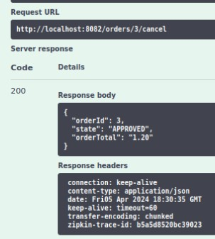
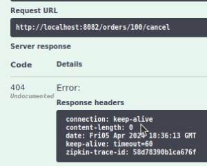

# Scenario Test FTGO Kelompok A4
Repositori ini merupakan skenario test dan juga pengujian yang dilakukan pada aplikasi ftgo untuk memenuhi tugas mata kuliah PPLBO

## Team Member
1. Adinda Faayza Malika | 211524001
2. Fardan Al Jihad | 211524009
3. Muhamad Naufal Al Ghani | 211524016
4. Muhammad Dyfan Ramadhan | 211524018
5. Salma Edyna Putri | 211524025
6. Tabitha Salsabila Permana | 211524028

## Endpoint 
- Penambahan Order : POST /order
- Perubahan Order: POST /order/{orderId}/revise
- Pembatalan Order: POST /order/{orderId}/cancel

## Scenario Test
Penambahan Order (create order)
  1. Uji Create Order dengan consumer id dan restaurant id yang valid
  2. Uji Create Order dengan Consumer Id yang Invalid
  3. Uji Create Order dengan Restaurant Id yang invalid
  4. Uji Create Order dengan Consumer Id dan Restaurant Id yang invalid
  5. Uji Create Order dengan membiarkan beberapa field  kosong
     
Perubahan Order (revise order)
  1. Uji Revise Order dengan Order Id dan menuItem Id yang valid
  2. Uji Revise Order dengan Order Id yang valid dan menuItem Id yang invalid
  3. Uji Revise Order dengan menuItem Id yang valid dan Order Id yang invalid
  4. Uji Revise Order dengan Order Id dan menuItem Id yang invalid
     
Pembatalan Order (cancel order)
  1. Uji Cancel Order dengan Order Id yang valid
  2. Uji Cancel Order dengan Order Id yang invalid


## Test Scenario
| No | Requirement ID  | Test Scenario                     | Test Case                                                                                             |
| -- | --------------- | --------------------------------- |-------------------------------------------------------------------------------------------------------|
|  1 |                 | Cek Fungsionalitas Create Order   | 1. Uji Create Order dengan consumer id dan restaurant id yang valid     |
|    |                 |                                   | 2. Uji Create Order dengan Consumer Id yang Invalid |
|    |                 |                                   | 3. Uji Create Order dengan Restaurant Id yang invalid |
|    |                 |                                   | 4. Uji Create Order dengan Consumer Id dan Restaurant Id yang invalid |
|    |                 |                                   | 5. Uji Create Order dengan membiarkan beberapa field  kosong |
|  2 |                 | Cek Fungsionalitas Revise Order   | 1. Uji Revise Order dengan Order Id dan menuItem Id yang valid |
|    |                 |                                   | 2. Uji Revise Order dengan Order Id yang valid dan menuItem Id yang invalid |
|    |                 |                                   | 3. Uji Revise Order dengan menuItem Id yang valid dan Order Id yang invalid |
|    |                 |                                   | 4. Uji Revise Order dengan Order Id dan menuItem Id yang invalid |
|  3 |                 | Cek Fungsionalitas Cancel Order   | 1. Uji Cancel Order dengan Order Id yang valid |
|    |                 |                                   | 2. Uji Cancel Order dengan Order Id yang invalid |


## End-to-end tests
### End-to-end tests Create Order
| Feature      | Create Order |
| :----------- | :------------|
| Requirements | Sebagai consumer saya ingin bisa membuat order | 
| Scenario     | 1. Given a valid consumer |
|              | 2. Given using a valid credit card |
|              | 3. Given the restaurant is accepting orders |
|              | 4. When I place an order for Ayam Geprek at Resto Geprek |
|              | 5.    Then the order should be APPROVED |
|              | 6. Then the order total should be 1.20 |

### End-to-end tests Revise Order
| Feature      | Revise Order |
| :----------- | :------------|
| Requirements | Sebagai consumer saya ingin bisa merevisi atau mengubah order | 
| Scenario     | 1. Given a valid consumer |
|              | 2. Given the restaurant is accepting orders |
|              | 3. When I place an order for Ayam Geprek at Resto Geprek |
|              | 4.    Then the order should be APPROVED |
|              | 5. Then the order total should be 1.20 |
|              | 6. And when I revise the order by adding 2 Ayam Geprek Sambal Ijo |
|              | 7.    Then the order total should be 3.40 |

### End-to-end tests Cancel Order
| Feature      | Cancel Order |
| :----------- | :------------|
| Requirements | Sebagai consumer saya ingin bisa membatalkan order | 
| Scenario     | 1. Given a valid consumer |
|              | 2. Given using a valid credit card |
|              | 3. Given the restaurant is accepting orders |
|              | 4. When I place an order for Ayam Geprek at Resto Geprek |
|              | 5.    Then the order should be APPROVED |
|              | 6. Then the order total should be 1.20 |
|              | 7. And when I cancel the order |
|              | 8.    Then the order should be CANCELLED |

### End-to-end tests Revise Order and Cancel Order
| Feature      | Revise Order and Cancel Order |
| :----------- | :------------|
| Requirements | Sebagai consumer saya ingin bisa membatalkan order setelah saya merevisi order | 
| Scenario     | 1. Given a valid consumer |
|              | 2. Given using a valid credit card |
|              | 3. Given the restaurant is accepting orders |
|              | 4. When I place an order for Ayam Geprek at Resto Geprek |
|              | 5.    Then the order should be APPROVED |
|              | 6. Then the order total should be 1.20 |
|              | 7. And when I revise the order by adding 2 Ayam Geprek Sambal Ijo |
|              | 8.    Then the order total should be 3.40 |
|              | 9. And when I cancel the order |
|              | 10.  Then the order should be CANCELLED |


## Pengujian 

- ## Creat Order
  
  Sebelum membuat pesanan, perlu menambahkan data consumer dan data restaurant terlebih dahulu untuk menguji Create Order dengan consumer id dan restaurant id yang valid.
  * Membuat data consumer (POST /consumers create)

    input data:
    ```json
    {
      "name" : {
        "firstname" : "jhon",
        "lastname" : "doe"
      }
    }
    ```
  * Membuat data restaurant (POST /restaurants create)

    Input data: 
    ```json
    {
      "address": {
        "city": "Cimahi",
        "state": "Indonesia",
        "street1": "Jl. Maharmartanegara",
        "street2": "Jl. Gatot Subroto",
        "zip": "40522"
      },
      "menu": {
        "menuItems": [
          {
            "id": "1",
            "name": "Ayam Geprek",
            "price": 1.20
          },
         {
            "id": "2",
            "name": "Ayam Geprek Sambal Ijo",
            "price": 1.70
          }
    
        ]
      },
      "name": "Resto Geprek"
    }
    ```
  #### 1. Uji Create Order dengan consumer id dan restaurant id yang valid
  - POST /orders create

    Input data dan respon server: 

    | Scenario      | Uji Create Order dengan consumer id dan restaurant id yang valid |
    |:--------------|:---------------------------------------------------------------------------------|
    | **Preconditions** | Data restoran dan consumer yang akan digunakan sudah terdaftar               | 
    | **Steps To Execute** | 1. Akses Swagger UI pada localhost:8082/swagger-ui/index.html<br>2. Klik order-controller<br>3. Klik POST /orders<br>4. Klik Try it Out<br>5. Input test data pada request body<br>6. Klik tombol "Execute" |
    | **Test Data** | <pre lang="json">{&#13;  "consumerId": 1,&#13;  "deliveryAddress": {&#13;    "city": "Bandung",&#13;    "state": "Indonesia",&#13;    "street1": "Jl. Asia Afrika",&#13;    "street2": "Jl. Merdeka",&#13;    "zip": "40111"&#13;  },&#13;  "deliveryTime": "2024-04-05T07:31:02.414Z",&#13;  "lineItems": [&#13;    {&#13;      "menuItemId": "1",&#13;      "quantity": 1&#13;    }&#13;  ],&#13;  "restaurantId": 1&#13;}</pre>|
    | **Expected Result** | ``` "orderId": 1 ``` |
    | **Actual Result** | ``` "orderId": 1 ``` |
    | **Test Result** | PASS |
    | **Screenshot Hasil** |  |  
  
  
  #### 2. Uji Create Order dengan Consumer Id yang invalid
  - POST /orders create
  
    input data :

    | Scenario      | Uji Create Order dengan consumer id yang invalid |
    |:--------------|:---------------------------------------------------------------------------------|
    | **Preconditions** | Data restoran yang akan digunakan sudah terdaftar              | 
    | **Steps To Execute** | 1. Akses Swagger UI pada localhost:8082/swagger-ui/index.html<br>2. Klik order-controller<br>3. Klik POST /orders<br>4. Klik Try it Out<br>5. Input test data pada request body<br>6. Klik tombol "Execute" |
    | **Test Data** | <pre lang="json">{&#13;  "consumerId": 0,&#13;  "deliveryAddress": {&#13;    "city": "Bandung",&#13;    "state": "Indonesia",&#13;    "street1": "Jl. Asia Afrika",&#13;    "street2": "Jl. Merdeka",&#13;    "zip": "40111"&#13;  },&#13;  "deliveryTime": "2024-04-05T07:31:02.414Z",&#13;  "lineItems": [&#13;    {&#13;      "menuItemId": "1",&#13;      "quantity": 1&#13;    }&#13;  ],&#13;  "restaurantId": 1&#13;}</pre>|
    | **Expected Result** | </pre> Response Body:<br><pre lang="json">"status": 500 &#13;"error": "Internal Server Error" &#13;"message": "Consumer not found with id 0" &#13;"path": "/orders"</pre> |
    | **Actual Result** | ``` "orderId": 2 ``` |
    | **Test Result** | FAIL |
    | **Screenshot Hasil** | *POST /orders create*<br><br><br>*GET /orders/{orderId} getOrder untuk melihat order state*<br> |  

  #### 3. Uji Create Order dengan Restaurant Id yang invalid
  - POST /orders create
    
    input data : 

    | Scenario      | Uji Create Order dengan Restaurant Id yang invalid |
    |:--------------|:---------------------------------------------------------------------------------|
    | **Preconditions** | Data consumer yang akan digunakan sudah terdaftar             | 
    | **Steps To Execute** | 1. Akses Swagger UI pada localhost:8082/swagger-ui/index.html<br>2. Klik order-controller<br>3. Klik POST /orders<br>4. Klik Try it Out<br>5. Input test data pada request body<br>6. Klik tombol "Execute" |
    | **Test Data** | <pre lang="json">{&#13;  "consumerId": 1,&#13;  "deliveryAddress": {&#13;    "city": "Bandung",&#13;    "state": "Indonesia",&#13;    "street1": "Jl. Asia Afrika",&#13;    "street2": "Jl. Merdeka",&#13;    "zip": "40111"&#13;  },&#13;  "deliveryTime": "2024-04-05T07:31:02.414Z",&#13;  "lineItems": [&#13;    {&#13;      "menuItemId": "1",&#13;      "quantity": 1&#13;    }&#13;  ],&#13;  "restaurantId": 0&#13;}</pre>|
    | **Expected Result** | </pre> Response Body:<br><pre lang="json">"status": 500 &#13;"error": "Internal Server Error" &#13;"message": "Restaurant not found with id 0" &#13;"path": "/orders"</pre> |
    | **Actual Result** | </pre> Response Body:<br><pre lang="json">"status": 500 &#13;"error": "Internal Server Error" &#13;"message": "Restaurant not found with id 0" &#13;"path": "/orders"</pre> |
    | **Test Result** | PASS |
    | **Screenshot Hasil** | |  
  
  #### 4. Uji Create Order dengan Consumer Id dan Restaurant Id yang invalid
  - POST /orders create
    
    input data : 

    | Scenario      | Uji Create Order dengan Consumer Id dan Restaurant Id yang invalid |
    |:--------------|:---------------------------------------------------------------------------------|
    | **Preconditions** | -             | 
    | **Steps To Execute** | 1. Akses Swagger UI pada localhost:8082/swagger-ui/index.html<br>2. Klik order-controller<br>3. Klik POST /orders<br>4. Klik Try it Out<br>5. Input test data pada request body<br>6. Klik tombol "Execute" |
    | **Test Data** | <pre lang="json">{&#13;  "consumerId": 0,&#13;  "deliveryAddress": {&#13;    "city": "Bandung",&#13;    "state": "Indonesia",&#13;    "street1": "Jl. Asia Afrika",&#13;    "street2": "Jl. Merdeka",&#13;    "zip": "40111"&#13;  },&#13;  "deliveryTime": "2024-04-05T07:31:02.414Z",&#13;  "lineItems": [&#13;    {&#13;      "menuItemId": "1",&#13;      "quantity": 1&#13;    }&#13;  ],&#13;  "restaurantId": 0&#13;}</pre>|
    | **Expected Result** | </pre> Response Body:<br><pre lang="json">"status": 500 &#13;"error": "Internal Server Error"&#13;"message": "Consumer not found with id 0. Restaurant not found with id 0"&#13;"path": "/orders"</pre> |
    | **Actual Result** | </pre> Response Body:<br><pre lang="json">"status": 500 &#13;"error": "Internal Server Error"&#13;"message": "Consumer not found with id 0."&#13;"path": "/orders"</pre>  |
    | **Test Result** | FAIL |
    | **Screenshot Hasil** | |  

  #### 5. Uji Create Order dengan membiarkan beberapa field  kosong
  - POST /orders create
    
    input data : 

    | Scenario      | Uji Create Order dengan membiarkan beberapa field  kosong |
    |:--------------|:---------------------------------------------------------------------------------|
    | **Preconditions** | -             | 
    | **Steps To Execute** | 1. Akses Swagger UI pada localhost:8082/swagger-ui/index.html<br>2. Klik order-controller<br>3. Klik POST /orders<br>4. Klik Try it Out<br>5. Input test data pada request body<br>6. Klik tombol "Execute" |
    | **Test Data** | <pre lang="json">{&#13;  "consumerId": 1,&#13;  "deliveryAddress": {&#13;    "city": "Bandung",&#13;    "street1": "Jl. Asia Afrika",&#13;    "zip": "40111"&#13;  },&#13;  "deliveryTime": "2024-04-05T07:31:02.414Z",&#13;  "lineItems": [&#13;    {&#13;      "menuItemId": "1",&#13;      "quantity": 1&#13;    }&#13;  ],&#13;  "restaurantId": 1&#13;}</pre>|
    | **Expected Result** | </pre> Response Body:<br><pre lang="json">{&#13; "orderId" : 3, &#13; "state" : "APPROVED", &#13; "orderTotal" : 1.20&#13;}|
    | **Actual Result** | </pre> Response Body:<br><pre lang="json">{&#13; "orderId" : 3, &#13; "state" : "APPROVED", &#13; "orderTotal" : 1.20&#13;} |
    | **Test Result** | PASS |
    | **Screenshot Hasil** | *POST /orders create*<br><br><br>*GET /orders/{orderId} getOrder untuk melihat order state*<br> |  


- ## Revise Order
  
  #### 1. Uji Revise Order dengan Order Id dan menuItem Id yang valid
  - POST /orders/{orderId}/revise

    Input data dan respon server:
    
    | Scenario      | Uji Revise Order dengan Order Id dan menuItem Id yang valid |
    |:--------------|:---------------------------------------------------------------------------------|
    | **Preconditions** | Data order dan menu yang akan digunakan sudah terdaftar.             | 
    | **Steps To Execute** | 1. Akses Swagger UI pada localhost:8082/swagger-ui/index.html<br>2. Klik order-controller<br>3. Klik POST /order/{orderId}/revise<br>4. Klik Try it Out<br>5. Input test data pada request body<br>6. Klik tombol "Execute" |
    | **Test Data** | ```orderId = 4```<br><br><pre lang="json">{&#13;  "revisedOrderLineItems": [&#13;    {&#13;      "menuItemId": "1",&#13;      "quantity": 5&#13;    },&#13;    {&#13;      "menuItemId": "2",&#13;      "quantity": 3&#13;    }&#13;  ]&#13;}</pre> |
    | **Expected Result** | </pre> Response Body:<br><pre lang="json">{&#13;  "orderId": 4,&#13;  "state": "APPROVED",&#13;  "orderTotal": "7.00"&#13;}</pre> |
    | **Actual Result** | </pre> Response Body:<br><pre lang="json">{&#13;  "orderId": 4,&#13;  "state": "APPROVED",&#13;  "orderTotal": "7.00"&#13;}</pre>  |
    | **Test Result** | PASS |
    | **Screenshot Hasil** | |  
  
  #### 2. Uji Revise Order dengan Order Id yang valid dan menuItem Id yang invalid
  - POST /orders/{orderId}/revise
    Input data dan respon server:

    | Scenario      | Uji Revise Order dengan Order Id yang valid dan menuItem Id yang invalid |
    |:--------------|:---------------------------------------------------------------------------------|
    | **Preconditions** | Data order yang akan digunakan sudah terdaftar.             | 
    | **Steps To Execute** | 1. Akses Swagger UI pada localhost:8082/swagger-ui/index.html<br>2. Klik order-controller<br>3. Klik POST /order/{orderId}/revise<br>4. Klik Try it Out<br>5. Input test data pada request body<br>6. Klik tombol "Execute" |
    | **Test Data** | ```orderId = 4```<br><br><pre lang="json">{&#13;  "revisedOrderLineItems": [&#13;    {&#13;      "menuItemId": "0",&#13;      "quantity": 5&#13;    },&#13;    {&#13;      "menuItemId": "3",&#13;      "quantity": 3&#13;    }&#13;  ]&#13;}</pre> |
    | **Expected Result** | Menampilkan kode response 500 dengan message error "Menu not found with id 4" |
    | **Actual Result** | </pre> Response Body:<br><pre lang="json">{&#13;  "orderId": 4,&#13;  "state": "APPROVED",&#13;  "orderTotal": "11.10"&#13;}</pre> |
    | **Test Result** | PASS |
    | **Screenshot Hasil** | |  

  #### 3. Uji Revise Order dengan menuItem Id yang valid dan Order Id yang invalid
  - POST /orders/{orderId}/revise
  
    Input data dan respon server:

    | Scenario      | Uji Revise Order dengan menuItem Id yang valid dan Order Id yang invalid |
    |:--------------|:---------------------------------------------------------------------------------|
    | **Preconditions** | Data menu  yang akan digunakan sudah terdaftar.             | 
    | **Steps To Execute** | 1. Akses Swagger UI pada localhost:8082/swagger-ui/index.html<br>2. Klik order-controller<br>3. Klik POST /order/{orderId}/revise<br>4. Klik Try it Out<br>5. Input test data pada request body<br>6. Klik tombol "Execute" |
    | **Test Data** | ```orderId = 10```<br><br><pre lang="json">{&#13;  "revisedOrderLineItems": [&#13;    {&#13;      "menuItemId": "1",&#13;      "quantity": 2&#13;    }&#13;  ]&#13;}</pre> |
    | **Expected Result** | Menampilkan kode response 404 |
    | **Actual Result** | Menampilkan kode response 404 |
    | **Test Result** | PASS |
    | **Screenshot Hasil** | |  

  #### 4. Uji Revise Order dengan Order Id dan menuItem Id yang invalid
  - POST /orders/{orderId}/revise
    
    Input data dan respon server:

    | Scenario      | Uji Revise Order dengan Order Id dan menuItem Id yang invalid |
    |:--------------|:---------------------------------------------------------------------------------|
    | **Preconditions** | -           | 
    | **Steps To Execute** | 1. Akses Swagger UI pada localhost:8082/swagger-ui/index.html<br>2. Klik order-controller<br>3. Klik POST /order/{orderId}/revise<br>4. Klik Try it Out<br>5. Input test data pada request body<br>6. Klik tombol "Execute" |
    | **Test Data** | ```orderId = 0```<br><br><pre lang="json">{&#13;  "revisedOrderLineItems": [&#13;    {&#13;      "menuItemId": "0",&#13;      "quantity": 2&#13;    }&#13;  ]&#13;}</pre> |
    | **Expected Result** | Menampilkan code error 404 |
    | **Actual Result** | Menampilkan code error 404 |
    | **Test Result** | PASS |
    | **Screenshot Hasil** | |

- ## Cancel Order
  
  #### 1. Uji Cancel Order dengan Order Id yang valid

  - POST /orders/{orderId}/cancel
    
    input data dan response server: 

    | Scenario      | Uji Cancel Order dengan Order Id yang valid |
    |:--------------|:---------------------------------------------------------------------------------|
    | **Preconditions** | Data order yang akan digunakan sudah terdaftar.             | 
    | **Steps To Execute** | 1. Akses Swagger UI pada localhost:8082/swagger-ui/index.html<br>2. Klik order-controller<br>3. Klik POST /order/{orderId}/cancel<br>4. Klik Try it Out<br>5. Input test data pada request body<br>6. Klik tombol "Execute" |
    | **Test Data** | ```orderId = 3``` |
    | **Expected Result** | <pre lang="json">{&#13;  "orderId": 5,&#13;  "state": "CANCELLED",&#13;  "orderTotal": "105.00"&#13;}</pre> |
    | **Actual Result** | <pre lang="json">{&#13;  "orderId": 5,&#13;  "state": "APPROVED",&#13;  "orderTotal": "105.00"&#13;}</pre> |
    | **Test Result** | FAIL |
    | **Screenshot Hasil** |  |  

  #### 2. Uji Cancel Order dengan Order Id yang invalid

  - POST /orders/{orderId}/cancel
    
    input data dan response server: 

    | Scenario      | Uji Cancel Order dengan Order Id yang invalid |
    |:--------------|:---------------------------------------------------------------------------------|
    | **Preconditions** | -             | 
    | **Steps To Execute** | 1. Akses Swagger UI pada localhost:8082/swagger-ui/index.html<br>2. Klik order-controller<br>3. Klik POST /order/{orderId}/cancel<br>4. Klik Try it Out<br>5. Input test data pada request body<br>6. Klik tombol "Execute" |
    | **Test Data** | ```orderId = 100``` |
    | **Expected Result** | Menampilkan Error Code 404 |
    | **Actual Result** | Menampilkan Error Code 404 |
    | **Test Result** | PASS |
    | **Screenshot Hasil** |  |  