# Scenario Test FTGO Kelompok A4
Repositori ini merupakan skenario test dan juga pengujian yang dilakukan pada aplikasi ftgo untuk memenuhi tugas mata kuliah PPLBO

## Endpoint 
- Penambahan Order : POST /order
- Perubahan Order: POST /order/{orderId}/revise
- Pembatalan Order: POST /order/{orderId}/cancel

## Scenario Test
Penambahan Order
  1. Uji penambahan order yang data consumer id nya tidak ada pada DB
  2. Uji penambahan order yang data restaurant id nya tidak ada pada DB
  3. Uji penambahan order yang data consumer id dan restaurant id ada pada DB
     
Perubahan Order
  1. Uji perubahan order yang order id nya tidak ada pada DB
  2. Uji perubahan order yang order id nya ada tetapi menu yang direvisi nya tidak sesuai dengan yang di order
  3. Uji perubahan order yang order id nya ada dan menu yang direvisi nya sesuai dengan yang di order
     
Pembatalan Order
1. Uji pembatalan order yang order id nya tidak ada pada DB 
2. Uji pembatalan order yang order id nya ada pada DB


## Test Scenario
| No | Requirement ID  | Test Scenario                     | Test Case                                                                                             |
| -- | --------------- | --------------------------------- |-------------------------------------------------------------------------------------------------------|
|  1 |                 | Cek Fungsionalitas Create Order   | 1. Uji Revise Order dengan Order Id yang valid dan menu yang direvisi sesuai dengan yang di-order     |
|    |                 |                                   | 2. Uji Revis Order dengan Order Id yang valid dan menu yang direvisi tidak sesuai dengan yang di-order |
|    |                 |                                   | 3. Uji Create Order dengan Order Id yang invalid |
|  2 |                 | Cek Fungsionalitas Revise Order   | 1. Uji Revise Order dengan Order Id yang valid dan menu yang direvisi sesuai dengan yang di-order |
|    |                 |                                   | 2. Uji Revis Order dengan Order Id yang valid dan menu yang direvisi tidak sesuai dengan yang di-order |
|    |                 |                                   | 3. Uji Create Order dengan Order Id yang invalid |
|  3 |                 | Cek Fungsionalitas Cancel Order   | 1. Uji Cancel Order dengan Order Id yang valid |
|    |                 |                                   | 2. Uji Cancel Order dengan Order Id yang invalid |


## End-to-end tests
### End-to-end tests Create Order
| Feature      | Create Order |
| :----------- | :------------|
| Requirements | Sebagai consumer saya ingin bisa membuat order | 
| Scenario     | 1. Given a valid consumer |
|              | 2. Given using a valid credit card |
|              | 3. Given the restaurant is accepting orders |
|              | 4. When I place an order for Ayam Geprek at Resto Geprek |
|              | 5.    Then the order should be APPROVED |
|              | 6. Then the order total should be 1.20 |

### End-to-end tests Revise Order
| Feature      | Revise Order |
| :----------- | :------------|
| Requirements | Sebagai consumer saya ingin bisa merevisi atau mengubah order | 
| Scenario     | 1. Given a valid consumer |
|              | 2. Given the restaurant is accepting orders |
|              | 3. When I place an order for Ayam Geprek at Resto Geprek |
|              | 4.    Then the order should be APPROVED |
|              | 5. Then the order total should be 1.20 |
|              | 6. And when I revise the order by adding 2 Ayam Geprek Sambal Ijo |
|              | 7.    Then the order total should be 3.40 |

### End-to-end tests Cancel Order
| Feature      | Cancel Order |
| :----------- | :------------|
| Requirements | Sebagai consumer saya ingin bisa membatalkan order | 
| Scenario     | 1. Given a valid consumer |
|              | 2. Given using a valid credit card |
|              | 3. Given the restaurant is accepting orders |
|              | 4. When I place an order for Ayam Geprek at Resto Geprek |
|              | 5.    Then the order should be APPROVED |
|              | 6. Then the order total should be 1.20 |
|              | 7. And when I cancel the order |
|              | 8.    Then the order should be CANCELLED |

### End-to-end tests Revise Order and Cancel Order
| Feature      | Revise Order and Cancel Order |
| :----------- | :------------|
| Requirements | Sebagai consumer saya ingin bisa membatalkan order setelah saya merevisi order | 
| Scenario     | 1. Given a valid consumer |
|              | 2. Given using a valid credit card |
|              | 3. Given the restaurant is accepting orders |
|              | 4. When I place an order for Ayam Geprek at Resto Geprek |
|              | 5.    Then the order should be APPROVED |
|              | 6. Then the order total should be 1.20 |
|              | 7. And when I revise the order by adding 2 Ayam Geprek Sambal Ijo |
|              | 8.    Then the order total should be 3.40 |
|              | 9. And when I cancel the order |
|              | 10.  Then the order should be CANCELLED |


## Pengujian 

- ## Creat Order
  
  Sebelum membuat pesanan, perlu menambahkan data consumer dan data restaurant terlebih dahulu untuk menguji Create Order dengan consumer id dan restaurant id yang valid.
  * Membuat data consumer (POST /consumers create)

    input data:
    ```json
    {
    "name" : {
        "firstname" : "jhon",
        "lastname" : "doe"
     }
    }
    ```
  * Membuat data restaurant (POST /restaurants create)

    Input data: 
    ```json
    {
      "address": {
        "city": "Cimahi",
        "state": "Indonesia",
        "street1": "Jl. Maharmartanegara",
        "street2": "Jl. Gatot Subroto",
        "zip": "40522"
      },
      "menu": {
        "menuItems": [
          {
            "id": "1",
            "name": "Ayam Geprek",
            "price": 1.20
          },
         {
            "id": "2",
            "name": "Ayam Geprek Sambal Ijo",
            "price": 1.70
          }
    
        ]
      },
      "name": "Resto Geprek"
    }
    ```
  #### 1. Uji Create Order dengan consumer id dan restaurant id yang valid
  - POST /orders create

    Input data dan respon server: 

    **Data**

    ```json
    {
      "consumerId": 1,
      "deliveryAddress": {
        "city": "Bandung",
        "state": "Indonesia",
        "street1": "Jl. Asia Afrika",
        "street2": "Jl. Merdeka",
        "zip": "40111"
      },
      "deliveryTime": "2024-04-05T07:31:02.414Z",
      "lineItems": [
        {
          "menuItemId": "1",
          "quantity": 1
        }
      ],
      "restaurantId": 1
    }

    ```
    
    **Response Body**
    ```json
    {
        "orderId": 1
    }
    ```
    **Screenshot Hasil**
  
    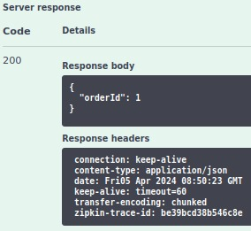

  #### 2. Uji Create Order dengan Consumer Id yang invalid
  - POST /orders create
  
    input data :

    **Data**

    ```json
    {
        "consumerId": 0,
        "deliveryAddress": {
          "city": "Bandung",
          "state": "Indonesia",
          "street1": "Jl. Asia Afrika",
          "street2": "Jl. Merdeka",
          "zip": "40111"
        },
        "deliveryTime": "2024-04-05T07:31:02.414Z",
        "lineItems": [
          {
            "menuItemId": "1",
            "quantity": 1
          }
        ],
        "restaurantId": 1
    }
    ```
    **Screenshot Hasil**
    
    *POST /orders create*
    
    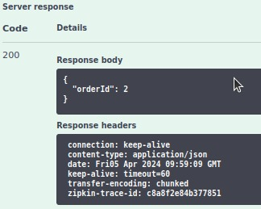

    *GET /orders/{orderId} getOrder untuk melihat order state*

    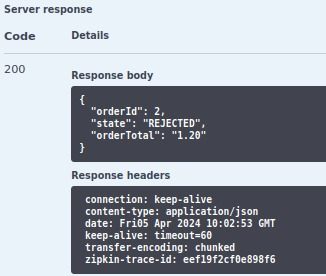

  #### 3. Uji Create Order dengan Restaurant Id yang invalid
  - POST /orders create
    
    input data : 

    **Data**

    ```json
    {
      "consumerId": 1,
      "deliveryAddress": {
        "city": "Bandung",
        "state": "Indonesia",
        "street1": "Jl. Asia Afrika",
        "street2": "Jl. Merdeka",
        "zip": "40111"
      },
      "deliveryTime": "2024-04-05T07:31:02.414Z",
      "lineItems": [
        {
          "menuItemId": "1",
          "quantity": 1
        }
      ],
      "restaurantId": 0
    }
    ```
    **Screenshot Hasil**
  
    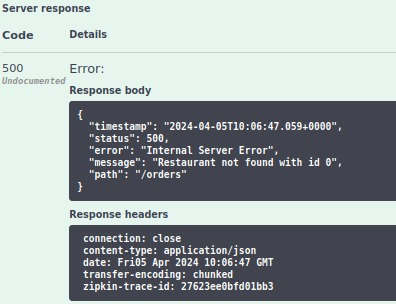
  
  #### 4. Uji Create Order dengan Consumer Id dan Restaurant Id yang invalid
  - POST /orders create
    
    input data : 

    **Data**

    ```json
    {
      "consumerId": 0,
      "deliveryAddress": {
        "city": "Bandung",
        "state": "Indonesia",
        "street1": "Jl. Asia Afrika",
        "street2": "Jl. Merdeka",
        "zip": "40111"
      },
      "deliveryTime": "2024-04-05T07:31:02.414Z",
      "lineItems": [
        {
          "menuItemId": "1",
          "quantity": 1
        }
      ],
      "restaurantId": 0
    }
    ```
    **Screenshot Hasil**
  
    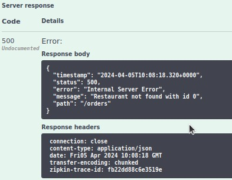
  
  #### 5. Uji Create Order dengan membiarkan beberapa field  kosong
  - POST /orders create
    
    input data : 

    **Data**

    ```json
    {
      "consumerId": 1,
      "deliveryAddress": {
        "city": "Bandung",
        "street1": "Jl. Asia Afrika",
        "zip": "40111"
      },
      "deliveryTime": "2024-04-05T07:31:02.414Z",
      "lineItems": [
        {
          "menuItemId": "1",
          "quantity": 1
        }
      ],
      "restaurantId": 1
    }
    ```
    **Screenshot Hasil**

    *POST /orders create*

    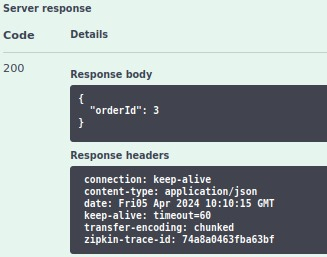

    *GET /orders/{orderId} getOrder untuk melihat order state*

    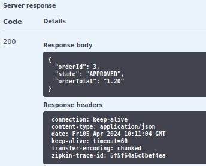

- ## Revise Order
  
  #### 1. Uji Revise Order dengan Order Id yang valid dan menu yang direvisi sesuai dengan yang di-order
  - POST /orders/{orderId}/revise

    Input data dan respon server:
    
    **Data**

    *POST /orders create*
    ```json
    {
      "consumerId": 1,
      "deliveryAddress": {
        "city": "Bandung",
        "state": "Indonesia",
        "street1": "Jl. Asia Afrika",
        "street2": "Jl. Merdeka",
        "zip": "40111"
      },
      "deliveryTime": "2024-04-05T07:31:02.414Z",
      "lineItems": [
        {
          "menuItemId": "1",
          "quantity": 3
        },
        {
          "menuItemId": "2",
          "quantity": 2
        }
      ],
      "restaurantId": 1
    }
    ```

    *POST /orders/{orderId}/revise revise*
    ```
    orderId: 4
    ```
    
    ```json
    {
      "revisedOrderLineItems": [
        {
          "menuItemId": "1",
          "quantity": 5
        },
        {
          "menuItemId": "2",
          "quantity": 3
        }
      ]
    }
    ```
  
    **Screenshot Hasil**
  
    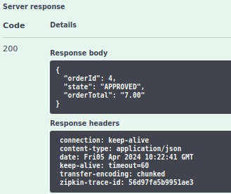
  
  #### 2. Uji Revise Order dengan Order Id yang valid dan menuItem Id yang invalid
  - POST /orders/{orderId}/revise
    Input data dan respon server:

    **Data**

    ```
    orderId: 4
    ```

    ```json
    {
      "revisedOrderLineItems": [
        {
          "menuItemId": "0",
          "quantity": 5
        },
        {
          "menuItemId": "3",
          "quantity": 3
        }
      ]
    }
    ```
    **Screenshot Hasil**

    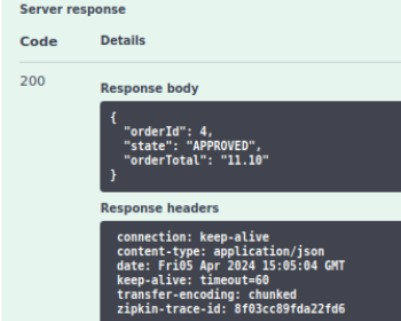

  #### 3. Uji Create Order dengan menuItem Id yang valid dan Order Id yang invalid
  - POST /orders/{orderId}/revise
  
    Input data dan respon server:

    **Data**

    ```
    orderId: 10
    ```

    ```json
    {
      "revisedOrderLineItems": [
        {
          "menuItemId": "1",
          "quantity": 2
        }
      ]
    }
    ```
    **Screenshot Hasil**

    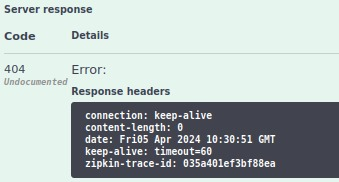

  #### 4. Uji Revise Order dengan Order Id dan menuItem Id yang invalid
  - POST /orders/{orderId}/revise
    
    Input data dan respon server:

    **Data**

    ```
    orderId: 0
    ```

    ```json
    {
      "revisedOrderLineItems": [
        {
          "menuItemId": "0",
          "quantity": 2
        }
      ]
    }
    ```
  
    **Screenshot Hasil**

    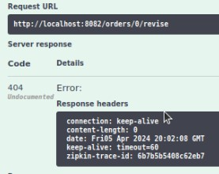

- ## Cancel Order
  
  #### 1. Uji Cancel Order dengan Order Id yang valid

  #### 2. Uji Cancel Order dengan Order Id yang invalid